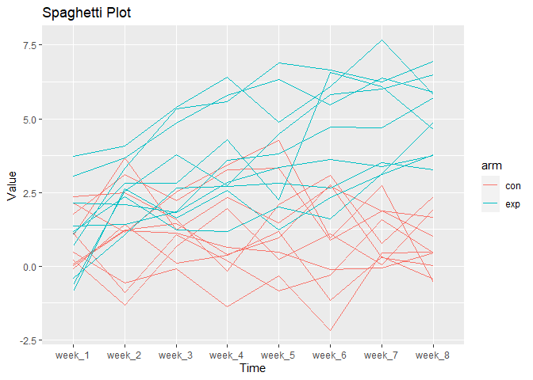

p8105_hw5_iho2104
================
Ixtaccihuatl Obregon
2023-11-12

``` r
library(tidyverse)
```

    ## ── Attaching core tidyverse packages ──────────────────────── tidyverse 2.0.0 ──
    ## ✔ dplyr     1.1.3     ✔ readr     2.1.4
    ## ✔ forcats   1.0.0     ✔ stringr   1.5.0
    ## ✔ ggplot2   3.4.3     ✔ tibble    3.2.1
    ## ✔ lubridate 1.9.2     ✔ tidyr     1.3.0
    ## ✔ purrr     1.0.2     
    ## ── Conflicts ────────────────────────────────────────── tidyverse_conflicts() ──
    ## ✖ dplyr::filter() masks stats::filter()
    ## ✖ dplyr::lag()    masks stats::lag()
    ## ℹ Use the conflicted package (<http://conflicted.r-lib.org/>) to force all conflicts to become errors

``` r
library(dplyr)
library(purrr)
library(ggplot2)
library(broom)
```

## Problem One

## Problem Two

``` r
## CON
file_paths_c = list.files("data", pattern = "con_\\d+\\.csv", full.names = TRUE)
controls = map_dfr(file_paths_c, read.csv) |> 
  mutate(id = c("con_01", "con_02", "con_03", "con_04", "con_05", "con_06", "con_07", "con_08", "con_09", "con_10" )) |> 
  select(id, everything()) 

## EXP
file_paths_e = list.files("data", pattern = "exp_\\d+\\.csv", full.names = TRUE)
exp = map_dfr(file_paths_e, read.csv) |> 
  mutate(id = c("exp_01", "exp_02", "exp_03", "exp_04", "exp_05", "exp_06", "exp_07", "exp_08", "exp_09", "exp_10" )) |> 
  select(id, everything()) 

# combined arms 
df = rbind(controls, exp) |> 
  separate(col = id, into = c("arm", "id"), sep = "_") |> 
  pivot_longer(cols = starts_with("week"), names_to = "week", values_to = "value") 

df_plot = df |> 
  mutate(sub_id = paste(arm, id, sep = "_"))

# spaghetti plot 
df_plot |> 
  ggplot(aes(x = week, y = value, group = sub_id, color = arm)) +
  geom_line() +
  labs(title = "Spaghetti Plot", x = "Time", y = "Value")
```

<!-- -->

## Problem Three

``` r
fix_n = 30 
fix_sigma = 5 
mu = 0 

datasets = vector("list", length = 5000)

for (i in 1:5000) {
  dataset = rnorm(fix_n, mean = mu, sd = fix_sigma)
}

t_test_result = t.test(dataset, mu = 0)
tidy_result = tidy(t_test_result)
datasets[[i]] = list(estimate = tidy_result$estimate,
                         p_value = tidy_result$p.value)

# Convert results to a data frame
results_df = do.call(rbind, datasets)
head(results_df)
```

    ##      estimate  p_value  
    ## [1,] 0.2991806 0.7382625
