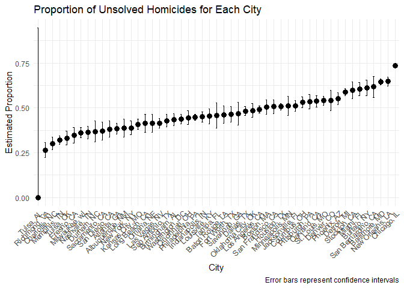
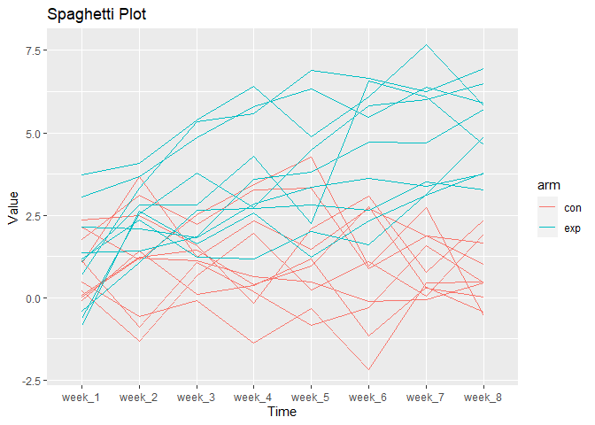
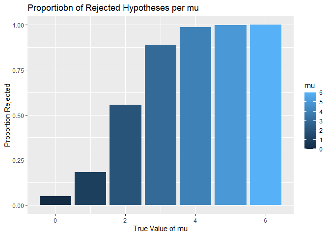
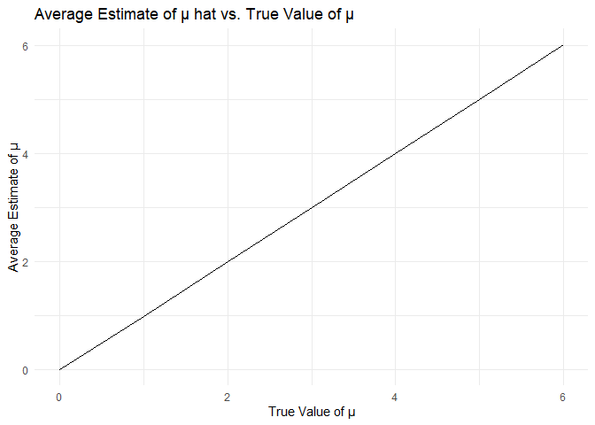
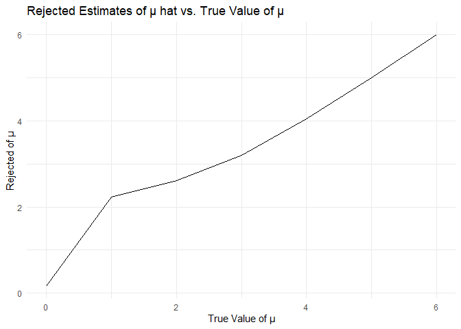

p8105_hw5_iho2104
================
Ixtaccihuatl Obregon
2023-11-15

``` r
library(tidyverse)
```

    ## ── Attaching core tidyverse packages ──────────────────────── tidyverse 2.0.0 ──
    ## ✔ dplyr     1.1.3     ✔ readr     2.1.4
    ## ✔ forcats   1.0.0     ✔ stringr   1.5.0
    ## ✔ ggplot2   3.4.3     ✔ tibble    3.2.1
    ## ✔ lubridate 1.9.2     ✔ tidyr     1.3.0
    ## ✔ purrr     1.0.2     
    ## ── Conflicts ────────────────────────────────────────── tidyverse_conflicts() ──
    ## ✖ dplyr::filter() masks stats::filter()
    ## ✖ dplyr::lag()    masks stats::lag()
    ## ℹ Use the conflicted package (<http://conflicted.r-lib.org/>) to force all conflicts to become errors

``` r
library(dplyr)
library(purrr)
library(ggplot2)
library(broom)
```

## Problem One

Describe the raw data.

``` r
homicide =
  read_csv("https://raw.githubusercontent.com/washingtonpost/data-homicides/master/homicide-data.csv")
```

    ## Rows: 52179 Columns: 12
    ## ── Column specification ────────────────────────────────────────────────────────
    ## Delimiter: ","
    ## chr (9): uid, victim_last, victim_first, victim_race, victim_age, victim_sex...
    ## dbl (3): reported_date, lat, lon
    ## 
    ## ℹ Use `spec()` to retrieve the full column specification for this data.
    ## ℹ Specify the column types or set `show_col_types = FALSE` to quiet this message.

There are 52179 observations and 12 variables that include: ‘uid’,
‘report_date’, ‘victim_last’\[name\], ‘victim_first’ \[name\],
‘victim_race’, ‘victim_age”, ’victim_sex’, ‘city’, ‘state’, ‘lat’,
‘lon’, and ‘disposition’. Identification, victim names, and locations
are given in the dataframe.

Create a ‘city_state’ variable and summarize within cities to obtain the
total number of homicides and the number of unsolved homicides.

``` r
homicide_df = 
  homicide |> 
  mutate(city_state = paste(city, state, sep = ", "))

disposition = 
  homicide_df |> 
  group_by(city_state) |> 
  summarize(homicide_n = n(), 
            unsolved_n = sum(disposition == "Closed without arrest" | disposition == "Open/No arrest"))

head(disposition)
```

    ## # A tibble: 6 × 3
    ##   city_state      homicide_n unsolved_n
    ##   <chr>                <int>      <int>
    ## 1 Albuquerque, NM        378        146
    ## 2 Atlanta, GA            973        373
    ## 3 Baltimore, MD         2827       1825
    ## 4 Baton Rouge, LA        424        196
    ## 5 Birmingham, AL         800        347
    ## 6 Boston, MA             614        310

For the city of Baltimore, MD, use the ‘prop.test’ function to estimate
the proportion of homicides that are unsolved; save the output of
prop.test as an R object, apply the ‘broom::tidy’ to this object and
pull the estimated proportion and confidence intervals from the
resulting tidy dataframe.

``` r
baltimore_md = 
disposition |> 
  filter(city_state == "Baltimore, MD")

prop_test_result = prop.test(x = baltimore_md$unsolved_n, n = baltimore_md$homicide_n) |> 
  tidy() |> 
  select(estimate, conf.low, conf.high)


baltimore_md
```

    ## # A tibble: 1 × 3
    ##   city_state    homicide_n unsolved_n
    ##   <chr>              <int>      <int>
    ## 1 Baltimore, MD       2827       1825

Now run prop.test for each of the cities in your dataset, and extract
both the proportion of unsolved homicides and the confidence interval
for each. Do this within a “tidy” pipeline, making use of purrr::map,
purrr::map2, list columns and unnest as necessary to create a tidy
dataframe with estimated proportions and CIs for each city.

``` r
result_df <- disposition |> 
  group_by(city_state) |> 
  nest() |> 
  mutate(
    prop_test_result = map(data, ~prop.test(x = .x$unsolved_n, n = .x$homicide_n) |> 
    tidy())) |> 
  unnest(prop_test_result) |> 
  select(city_state, estimate, conf.low, conf.high)
```

    ## Warning: There was 1 warning in `mutate()`.
    ## ℹ In argument: `prop_test_result = map(data, ~tidy(prop.test(x = .x$unsolved_n,
    ##   n = .x$homicide_n)))`.
    ## ℹ In group 49: `city_state = "Tulsa, AL"`.
    ## Caused by warning in `prop.test()`:
    ## ! Chi-squared approximation may be incorrect

``` r
result_df
```

    ## # A tibble: 51 × 4
    ## # Groups:   city_state [51]
    ##    city_state      estimate conf.low conf.high
    ##    <chr>              <dbl>    <dbl>     <dbl>
    ##  1 Albuquerque, NM    0.386    0.337     0.438
    ##  2 Atlanta, GA        0.383    0.353     0.415
    ##  3 Baltimore, MD      0.646    0.628     0.663
    ##  4 Baton Rouge, LA    0.462    0.414     0.511
    ##  5 Birmingham, AL     0.434    0.399     0.469
    ##  6 Boston, MA         0.505    0.465     0.545
    ##  7 Buffalo, NY        0.612    0.569     0.654
    ##  8 Charlotte, NC      0.300    0.266     0.336
    ##  9 Chicago, IL        0.736    0.724     0.747
    ## 10 Cincinnati, OH     0.445    0.408     0.483
    ## # ℹ 41 more rows

Create a plot that shows the estimates and CIs for each city – check out
geom_errorbar for a way to add error bars based on the upper and lower
limits. Organize cities according to the proportion of unsolved
homicides.

``` r
result_df = 
  result_df |> 
  arrange(estimate)  

ggplot(result_df, aes(x = reorder(city_state, estimate), y = estimate)) +
  geom_point(size = 3) +
  geom_errorbar(aes(ymin = conf.low, ymax = conf.high), width = 0.2) +
  labs(
    title = "Proportion of Unsolved Homicides for Each City",
    x = "City",
    y = "Estimated Proportion",
    caption = "Error bars represent confidence intervals"
  ) +
  theme_minimal() +
  theme(axis.text.x = element_text(angle = 45, hjust = 1)) 
```

<!-- -->

## Problem Two

``` r
## CON
file_paths_c = list.files("data", pattern = "con_\\d+\\.csv", full.names = TRUE)
controls = map_dfr(file_paths_c, read.csv) |> 
  mutate(id = c("con_01", "con_02", "con_03", "con_04", "con_05", "con_06", "con_07", "con_08", "con_09", "con_10" )) |> 
  select(id, everything()) 

## EXP
file_paths_e = list.files("data", pattern = "exp_\\d+\\.csv", full.names = TRUE)
exp = map_dfr(file_paths_e, read.csv) |> 
  mutate(id = c("exp_01", "exp_02", "exp_03", "exp_04", "exp_05", "exp_06", "exp_07", "exp_08", "exp_09", "exp_10" )) |> 
  select(id, everything()) 

# combined arms 
df = rbind(controls, exp) |> 
  separate(col = id, into = c("arm", "id"), sep = "_") |> 
  pivot_longer(cols = starts_with("week"), names_to = "week", values_to = "value") 

df_plot = df |> 
  mutate(sub_id = paste(arm, id, sep = "_"))

# spaghetti plot 
df_plot |> 
  ggplot(aes(x = week, y = value, group = sub_id, color = arm)) +
  geom_line() +
  labs(title = "Spaghetti Plot", x = "Time", y = "Value")
```

<!-- -->

The plot shows the experiment arm to have higher values compared to the
control arm. During week 3 through week 8, the experimental arm shows a
noticeable set of higher values compared to the control arm.

## Problem Three

Following chunk attempted to integrate a for loop and function to obtain
3500 observations consisting of variables: mu, iteration, estimate, and
p.value.

``` r
fix_n = 30 
fix_sigma = 5 
mu_val= c(0,1,2,3,4,5,6)
datasets = vector("list", length = 5000)

for (i in 1:5000) {
  dataset = rnorm(fix_n, mean = mu_val, sd = fix_sigma) # Generate a dataset
  t_test_results = lapply(mu_val, function(mu) {      # Function
  t_test_result = t.test(dataset, mu = mu)            # Perform t-test
  tidy_result = tidy(t_test_result)                   # Extract estimates and p-value 
  tibble::tibble(estimate = tidy_result$estimate[1],  # Assuming one-sided t-test
                   p_value = tidy_result$p.value[1])  # Assuming one-sided t-test
})
  
datasets[[i]] = do.call(rbind, t_test_results) 
}

results_df = do.call(rbind, datasets)
results_df = mutate(results_df, estimate = sub("sub_str", "", estimate)) |> 
select(estimate, p_value)
head(results_df)
```

I used the for-loop 7 times to generate my dataframe with 35000 obs and
4 variables.

``` r
#mu_val = 0 
fix_n = 30
fix_sigma = 5
mu = 0
datasets <- vector("list", length = 5000)

for (i in 1:5000) {
  dataset = rnorm(fix_n, mean = mu, sd = fix_sigma)
  t_test_result = t.test(dataset, mu = 0)
  tidy_result = broom::tidy(t_test_result)
  datasets[[i]] = tibble::tibble(
    mu = mu, 
    iteration = i, 
    estimate = tidy_result$estimate[1],
    p_value = tidy_result$p.value[1])
}


results_df_0 = do.call(rbind, datasets)


results_df_0 = mutate(results_df_0, estimate = sub("sub_str", "", estimate))  # Remove sub_str from estimate
results_df_0 = results_df_0 |> 
  select(mu, iteration,estimate, p_value)

head(results_df_0)
```

    ## # A tibble: 6 × 4
    ##      mu iteration estimate           p_value
    ##   <dbl>     <int> <chr>                <dbl>
    ## 1     0         1 1.04696691546167    0.336 
    ## 2     0         2 0.396923493178932   0.656 
    ## 3     0         3 0.543628913586303   0.633 
    ## 4     0         4 1.79934657412381    0.0336
    ## 5     0         5 1.02660384035003    0.236 
    ## 6     0         6 -0.860539507580207  0.326

``` r
#mu_val = 1
fix_n = 30
fix_sigma = 5
mu = 1
datasets <- vector("list", length = 5000)

for (i in 1:5000) {
  dataset = rnorm(fix_n, mean = mu, sd = fix_sigma)
  t_test_result = t.test(dataset, mu = 0)
  tidy_result = tidy(t_test_result)
  datasets[[i]] = tibble::tibble(
    mu = mu, 
    iteration = i, 
    estimate = tidy_result$estimate[1],
    p_value = tidy_result$p.value[1])
}

results_df_1a = do.call(rbind, datasets)
results_df_1a = mutate(results_df_1a, estimate = sub("sub_str", "", estimate), 
                      estimate = as.numeric(estimate))
results_df_1a = results_df_1a |> 
  select(mu, iteration,estimate, p_value)

head(results_df_1a)
```

    ## # A tibble: 6 × 4
    ##      mu iteration estimate p_value
    ##   <dbl>     <int>    <dbl>   <dbl>
    ## 1     1         1    1.57   0.111 
    ## 2     1         2   -0.634  0.545 
    ## 3     1         3    0.179  0.858 
    ## 4     1         4    0.646  0.540 
    ## 5     1         5    1.47   0.0891
    ## 6     1         6    1.01   0.333

``` r
#mu_val = 2
fix_n = 30
fix_sigma = 5
mu = 2
datasets <- vector("list", length = 5000)

for (i in 1:5000) {
  dataset = rnorm(fix_n, mean = mu, sd = fix_sigma)
  t_test_result = t.test(dataset, mu = 0)
  tidy_result = broom::tidy(t_test_result)
  datasets[[i]] = tibble::tibble(
    mu = mu, 
    iteration = i, 
    estimate = tidy_result$estimate[1],
    p_value = tidy_result$p.value[1])
}

results_df_2 = do.call(rbind, datasets)
results_df_2 = mutate(results_df_2, estimate = sub("sub_str", "", estimate))
results_df_2 = results_df_2 |> 
  select(mu, iteration,estimate, p_value)

head(results_df_2)
```

    ## # A tibble: 6 × 4
    ##      mu iteration estimate          p_value
    ##   <dbl>     <int> <chr>               <dbl>
    ## 1     2         1 1.66610115269183  0.0293 
    ## 2     2         2 0.577461687833498 0.501  
    ## 3     2         3 2.72848892224316  0.00176
    ## 4     2         4 1.07790586900143  0.174  
    ## 5     2         5 2.65859658182884  0.00441
    ## 6     2         6 1.83673984786989  0.0381

``` r
#mu_val = 3
fix_n = 30
fix_sigma = 5
mu = 3
datasets <- vector("list", length = 5000)

for (i in 1:5000) {
  dataset = rnorm(fix_n, mean = mu, sd = fix_sigma)
  t_test_result = t.test(dataset, mu = 0)
  tidy_result = broom::tidy(t_test_result)
  datasets[[i]] = tibble::tibble(
    mu = mu, 
    iteration = i, 
    estimate = tidy_result$estimate[1],
    p_value = tidy_result$p.value[1])
}

results_df_3 = do.call(rbind, datasets)
results_df_3 = mutate(results_df_3, estimate = sub("sub_str", "", estimate))
results_df_3 = results_df_3 |> 
  select(mu, iteration,estimate, p_value)

head(results_df_3)
```

    ## # A tibble: 6 × 4
    ##      mu iteration estimate           p_value
    ##   <dbl>     <int> <chr>                <dbl>
    ## 1     3         1 3.63706163450271 0.000829 
    ## 2     3         2 4.40798415650348 0.0000177
    ## 3     3         3 1.91154040705112 0.0594   
    ## 4     3         4 4.25201552122766 0.000708 
    ## 5     3         5 3.21926656690137 0.0000709
    ## 6     3         6 2.66294958876206 0.00801

``` r
#mu_val = 4
fix_n = 30
fix_sigma = 5
mu = 4
datasets <- vector("list", length = 5000)

for (i in 1:5000) {
  dataset = rnorm(fix_n, mean = mu, sd = fix_sigma)
  t_test_result = t.test(dataset, mu = 0)
  tidy_result = broom::tidy(t_test_result)
  datasets[[i]] = tibble::tibble(
    mu = mu, 
    iteration = i, 
    estimate = tidy_result$estimate[1],
    p_value = tidy_result$p.value[1])
}

results_df_4 = do.call(rbind, datasets)
results_df_4 = mutate(results_df_4, estimate = sub("sub_str", "", estimate))
results_df_4 = results_df_4 |> 
  select(mu, iteration,estimate, p_value)

head(results_df_4)
```

    ## # A tibble: 6 × 4
    ##      mu iteration estimate             p_value
    ##   <dbl>     <int> <chr>                  <dbl>
    ## 1     4         1 3.376643765354   0.00118    
    ## 2     4         2 3.80992818173086 0.00222    
    ## 3     4         3 3.73509426626788 0.000116   
    ## 4     4         4 5.43072776661106 0.000000207
    ## 5     4         5 5.31805901190433 0.000000558
    ## 6     4         6 3.93348810857753 0.000164

``` r
#mu_val = 5
fix_n = 30
fix_sigma = 5
mu = 5
datasets <- vector("list", length = 5000)

for (i in 1:5000) {
  dataset = rnorm(fix_n, mean = mu, sd = fix_sigma)
  t_test_result = t.test(dataset, mu = 0)
  tidy_result = broom::tidy(t_test_result)
  datasets[[i]] = tibble::tibble(
    mu = mu, 
    iteration = i, 
    estimate = tidy_result$estimate[1],
    p_value = tidy_result$p.value[1])
}

results_df_5 = do.call(rbind, datasets)
results_df_5 = mutate(results_df_5, estimate = sub("sub_str", "", estimate))
results_df_5 = results_df_5 |> 
  select(mu, iteration,estimate, p_value)

head(results_df_5)
```

    ## # A tibble: 6 × 4
    ##      mu iteration estimate              p_value
    ##   <dbl>     <int> <chr>                   <dbl>
    ## 1     5         1 4.80384832343281 0.0000761   
    ## 2     5         2 4.1428775902824  0.000643    
    ## 3     5         3 6.36703576435872 0.0000000442
    ## 4     5         4 4.15296519860597 0.000107    
    ## 5     5         5 5.01383551839464 0.0000247   
    ## 6     5         6 5.00477773191228 0.0000411

``` r
#mu_val = 6
fix_n = 30
fix_sigma = 5
mu = 6
datasets <- vector("list", length = 5000)

for (i in 1:5000) {
  dataset = rnorm(fix_n, mean = mu, sd = fix_sigma)
  t_test_result = t.test(dataset, mu = 0)
  tidy_result = broom::tidy(t_test_result)
  datasets[[i]] = tibble::tibble(
    mu = mu, 
    iteration = i, 
    estimate = tidy_result$estimate[1],
    p_value = tidy_result$p.value[1])
}

results_df_6 = do.call(rbind, datasets)
results_df_6 = mutate(results_df_6, estimate = sub("sub_str", "", estimate))
results_df_1 = results_df_6 |> 
  select(mu, iteration,estimate, p_value)

head(results_df_6)
```

    ## # A tibble: 6 × 4
    ##      mu iteration estimate          p_value
    ##   <dbl>     <int> <chr>               <dbl>
    ## 1     6         1 5.91327916788325 1.26e- 6
    ## 2     6         2 7.92961870054048 2.02e- 8
    ## 3     6         3 7.19987613500846 9.07e- 8
    ## 4     6         4 6.72121385474149 3.19e- 8
    ## 5     6         5 7.12441173588358 3.25e-11
    ## 6     6         6 6.16514323137621 2.63e- 6

``` r
combined_results = rbind(results_df_0, results_df_1a, results_df_2, results_df_3, results_df_4, results_df_5, results_df_6) |> 
  mutate(estimate = as.numeric(estimate))
```

Make a plot showing the proportion of times the null was rejected (the
power of the test) on the y axis and the true value of μ on the x axis.
Describe the association between effect size and power.

``` r
combined_results_power = 
  combined_results |> 
   mutate(reject = case_when(
    p_value > 0.05 ~ FALSE,
    p_value < 0.05 ~ TRUE
  )) |> 
  group_by(mu) |> 
  summarise(count = sum(reject)) |> 
  mutate(proportion = count / 5000)

combined_results_power |> 
  ggplot(aes(x = mu, y = proportion, fill = mu)) +
  geom_col() +
  labs(title = "Proportiobn of Rejected Hypotheses per mu",
       x = "True Value of mu", y = "Proportion Rejected")
```

<!-- -->
As the true mu increase, the proportion rejection increases.

Make a plot showing the average estimate of μ^ on the y axis and the
true value of μ on the x axis.

``` r
average_estimates = combined_results |> 
  group_by(mu) |> 
  summarize(avg_estimate = mean(estimate))

average_estimates = average_estimates[order(average_estimates$mu), ]

ggplot(average_estimates, aes(x = mu, y = avg_estimate)) +
  geom_line() +
  labs(title = "Average Estimate of μ hat vs. True Value of μ", x = "True Value of μ", y = "Average Estimate of μ") +
  theme_minimal()
```

<!-- -->

Make a second plot (or overlay on the first) the average estimate of
μ^only in samples for which the null was rejected on the y axis and the
true value of μ on the x axis.

``` r
rejected_estimates = 
  combined_results |> 
  mutate(reject = case_when(
  p_value > 0.05 ~ FALSE,
  p_value < 0.05 ~ TRUE
  )) |> 
  filter(reject == TRUE) |> 
  group_by(mu) |>
  summarize(muhat = mean(estimate))

ggplot(rejected_estimates, aes(x = mu, y = muhat)) +
  geom_line() +
  labs(title = "Rejected Estimates of μ hat vs. True Value of μ", x = "True Value of μ", y = "Rejected of μ") +
  theme_minimal()
```

<!-- -->

Is the sample average of μ^across tests for which the null is rejected
approximately equal to the true value of μ ? Why or why not? When mu is
0, 1, 2, 3, the rejection of mu is higher. When mu is 4, 5, 6, the
rejection of mu follows the average estimates.
